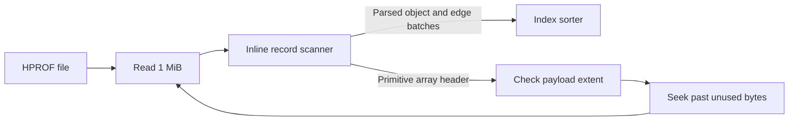

# minprof — Architecture

`minprof` analyses JVM `.hprof` heap dumps with a reusable on-disk index. It
streams the input in two scans and stores sorted object and edge files on disk.
Passes 3 and 4 still allocate arrays proportional to object and reference
counts, so a dump larger than available RAM is feasible when its graph fits
the host's memory; file size alone does not establish feasibility.

## Design goals

In priority order:

1. **Minimise peak RSS.** Keep the fastest correct computation where it fits,
   and develop a host-aware lower-memory path when graph or parser allocations
   exceed available memory. The current implementation does not enforce a
   whole-process memory budget.
2. **Minimise on-disk footprint.** Intermediate and index files use compact
   fixed-width binary records.
3. **Be faster than the alternatives** (Eclipse MAT, VisualVM) — memory savings
   must not cost throughput.
4. **Answer repeat queries without re-parsing.** Once the index directory
   exists, every report is generated from it (`-i <dir>`) with no HPROF re-read.

## Pipeline at a glance

```
                  .hprof
                    │
     ┌──────────────┼──────────────────────────────────────────┐
     │ Pass 1 — index            (stream the dump once)         │
     │   object_index.bin · shallow_sizes.bin                   │
     │   class_names.bin · roots.bin · in-RAM class index       │
     ├──────────────┼──────────────────────────────────────────┤
     │ Pass 2 — edges            (stream the dump again)        │
     │   edges.bin   (from_id, to_id) sorted by from_id         │
     ├──────────────┼──────────────────────────────────────────┤
     │ Pass 3 — dominator tree   (no HPROF read; works on .bin) │
     │   idom.bin    immediate dominator per node, RPO-indexed  │
     ├──────────────┼──────────────────────────────────────────┤
     │ Pass 4 — retained sizes   (no HPROF read)                │
     │   retained.bin  retained bytes per node                  │
     └──────────────┼──────────────────────────────────────────┘
                    │
              meta.bin (scalar summary)
                    │
     Query layer ───┴── histogram · retained-by-class · leak suspects ·
                        packages · treemap · path-to-GC-root
                        → pretty text / NDJSON / self-contained HTML
```

Only passes 1 and 2 read the HPROF file. Passes 3–4 work from the index.
The first report scans object and retained files and persists a derived summary;
later standard reports load that summary when its index generation matches.

## Streaming parser (`parser/record_stream_parser.rs`)

Passes 1 and 2 use a seek-aware reader. It reads 1 MiB at a time and parses
records in the same thread, so a primitive-array seek cannot race with read
ahead.



The extractor is an **inline byte scanner**, not a combinator parser: it walks
HPROF top-level records and `HEAP_DUMP` sub-records directly over the input
buffer and emits only the few fields each pass needs. A partially read record
is completed on the next chunk. Primitive payloads already in the buffer are
consumed; the remaining payload is checked against file and segment bounds
before a seek. The original
nom-based record parser from `hprof-slurp` is not used on the hot path.

## Pass 1 — index (`passes/index`)

Single streaming scan. The extractor emits, per record:

| HPROF record | Emitted item | Used for |
|---|---|---|
| `UTF8_STRING` | `(string_id, text)` | resolving class names |
| `LOAD_CLASS` | `(class_obj_id, name_string_id)` | resolving class names |
| `CLASS_DUMP` | super id, instance size, field descriptors, static-field byte sum | class index + class-object shallow size |
| `INSTANCE_DUMP` | `(object_id, class_id, data_size)` | object entry |
| `OBJ_ARRAY_DUMP` | `(object_id, class_id\|flag, shallow)` | object entry |
| `PRIM_ARRAY_DUMP` | `(object_id, synthetic class id, shallow)` | object entry |
| `ROOT_*` | `object_id` | GC roots |

Object entries are 20-byte records `(object_id: u64, class_id: u64,
shallow_size: u32)` pushed into the external sorter. A few synthetic small
`class_id` values (`0x01`..`0x0B`) encode `java.lang.Class` and the eight
primitive array types; bit 63 (`OBJECT_ARRAY_FLAG`) marks reference arrays — real
heap addresses never use those values, so no collision is possible.

`INSTANCE_DUMP` records initially store the raw field-block `data_size` as a
placeholder. During the final sort/merge a **fixup closure** patches each
instance entry's shallow size to the class's true `instance_size` (which includes
the object header) and simultaneously streams the patched size into the compact
`shallow_sizes.bin` sidecar, so pass 4 never re-reads the 20-byte index.

Resident memory: the class index (`class_id → ClassDescriptor`) plus the sort
buffer. The class index carries each class's instance-field descriptors because
pass 2 needs them.

## Pass 2 — edges (`passes/edges`)

A second scan extracts reference edges with zero per-object allocation. Before
scanning, `EdgeStreamExtractor` precomputes, for every class, the flat list of
byte offsets within an instance's field block at which an `Object`-typed field
lives — walking the superclass chain once so inherited fields are included. For
each `INSTANCE_DUMP` it then reads object references straight from those offsets;
for object arrays it emits one edge per non-null element except adjacent repeats; for class dumps it emits
edges from static `Object` fields.

Edges are 16-byte records `(from_id, to_id)` pushed into the external sorter with
**dedup enabled**, producing `edges.bin` sorted by `(from_id, to_id)` — a
disk-backed forward adjacency list. The reverse edge file is **not** built here;
it is produced on demand only when `--path` is used (a single extra read+sort),
keeping normal runs cheaper.

## External sort (`passes/sort.rs`)

All three passes that sort use one generic type, `RecordSorter<const N: usize>`,
parameterised by record width and a `fn(&[u8; N]) -> (u64, u64)` key:

- Records accumulate in a sort buffer sized at `sort_chunk_bytes()` (40% of
  system RAM, clamped to `[256 MiB, 128 GiB]`).
- When the buffer fills it is sorted (`rayon` parallel unstable sort) and written
  to a chunk file **on a background thread**, so the sort+write overlaps with
  continued production on the caller thread. At most one flush is in flight, so
  an old full buffer can coexist with a refilling new buffer. The sort target
  is an allocation target, not a whole-process RSS limit.
- `finish` does a k-way merge of the chunk files via a binary heap. Above
  `MAX_MERGE_FAN_IN` (64) chunks it uses a **two-level merge** to cap the open
  file-descriptor count.
- Two opt-in behaviours specialise it without separate sorter types:
  **dedup** (drop consecutive equal records — used by the edge sort) and a
  **fixup** closure applied to each record as it is written (used by pass 1 for
  the shallow-size patch + sidecar).

If everything fits in one buffer (the common case for small/medium dumps) there
are no chunk files at all — the buffer is sorted in place and written once.

## Pass 3 — dominator tree (`passes/dominators`)

Computes the immediate dominator of every reachable object using the **Semi-NCA**
algorithm (Georgiadis 2005), `O(E · α(N))`. A virtual root (node index `N`) has
edges to every GC root and dominates the whole graph. Steps:

1. **Load + resolve.** Read `object_index.bin` into a sorted `Vec<u64>` of object
   IDs (node index = array position); resolve GC-root IDs to node indices by
   binary search.
2. **Index the edges.** When every sorted object ID differs from the previous
   by one, compute each node index as `object_id - first_id`. Build forward CSR
   and reverse indexed edges directly from `edges.bin`; the ID vector is then
   released before CSR construction. Otherwise, two co-scans resolve
   `(from_id, to_id)` through an intermediate sort by target ID. The forward
   CSR is built by counting sort. Both paths preserve each source's ascending
   target order, so DFS and dominator outputs are identical.
3. **DFS** the forward CSR from the virtual root, streaming preorder, postorder,
   and parent-preorder arrays to disk. A packed-bit visited set keeps this small.
4. **Semi-NCA.** Phase 1 computes semidominators by processing predecessor edges
   in descending target-preorder with EVAL/LINK and iterative path compression
   (the three per-node arrays are packed into one 12-byte struct for cache
   locality). Phase 2 walks the DFS tree forward computing immediate dominators
   via nearest-common-ancestor.
5. **Emit** `idom.bin`: the immediate dominator of each node, indexed and stored
   in reverse-postorder (RPO) so pass 4 is a sequential sweep.

This is the runtime hotspot on graph-heavy inputs. The dense-ID path avoids
`partial_sorted` and `fwd_indexed`; other intermediate files are deleted as
soon as they are consumed.

## Pass 4 — retained sizes (`passes/retained`)

A node's retained size is its own shallow size plus the retained sizes of
everything it dominates. Working entirely in RPO space, the loop is:

```
for rpo in (1..reachable).rev():
    retained_rpo[idom[rpo]] += retained_rpo[rpo]
```

`idom[rpo]` and `retained_rpo[rpo]` are read sequentially as `rpo` decreases;
the only random access is the single accumulating write — far fewer cache misses
than working in node-index space. The result is rewritten to `retained.bin`
indexed by node so the query layer can join it against `object_index.bin`.
Unreachable-object counts/bytes fall out by subtraction (reachable totals vs. the
full shallow sum) without a second bitmap.

## Query layer (`query/`)

Every report is produced from the index files. On a summary-cache miss,
`collect_output` makes a **single streaming pass** over `object_index.bin`
joined with `retained.bin` (both are in node order) and computes simultaneously,
with memory proportional to the number of *classes*, not objects:

- class histogram (by total shallow allocation and by largest single instance),
- retained heap aggregated by class,
- the top-N individual objects by retained size (a bounded min-heap),
- package rollups and the HTML treemap hierarchy,
- leak suspects (classes retaining ≥ 1% of the heap, with a pattern label),
- GC-pressure counts (finalizer queue, soft/weak/phantom references).

The result is stored in `report_summary.json`. Later reports load it when the
generation matches `manifest.json`; missing, stale, or unreadable summaries
are recomputed. The manifest lists required index files and byte lengths and
is published after the four passes complete. It does not checksum contents.

`--path <id>` runs a BFS from the target over `reverse_edges.bin`, binary-
searching the sorted file for each node's referrers, until it reaches a GC root.
Output renders as aligned text tables, newline-delimited JSON (results on stdout,
progress on stderr), or a single dependency-free HTML file.

## On-disk index files

| File | Record | Bytes/record | Order | Purpose |
|---|---|---|---|---|
| `object_index.bin` | `(object_id, class_id, shallow_size)` | 20 | by `object_id` | the object table; node index = row number |
| `shallow_sizes.bin` | `shallow_size` | 4 | node order | pass-4 sidecar, avoids re-reading the 20-byte index |
| `class_names.bin` | `(class_id, super_id, name)` | var | by `class_id` | class names + super-chain for the query layer |
| `roots.bin` | `object_id` | 8 | sorted | GC roots |
| `edges.bin` | `(from_id, to_id)` | 16 | by `(from, to)` | forward reference graph |
| `reverse_edges.bin` | `(to_id, from_id)` | 16 | by `(to, from)` | path-to-root (built on demand) |
| `idom.bin` | `idom_rpo` | 4 | RPO order | dominator tree |
| `retained.bin` | `retained_bytes` | 8 | node order | retained size per object |
| `meta.bin` | 7 × `u64` | 56 | — | scalar summary (counts, totals, unreachable stats) |
| `manifest.json` | generation and file lengths | variable | — | index completion and summary invalidation |
| `report_summary.json` | derived report model | variable | — | repeat reports |

For `heap.hprof`, the index directory defaults to `heap.minprof/`.
`index_is_complete` validates the manifest and rejects a build-in-progress
marker; legacy indexes are structurally checked and receive a manifest.

## Memory & disk characteristics

- **Resident memory** during passes 1–2 includes recycled read buffers,
  an expandable work buffer, bounded edge batches, class metadata, and a sort
  buffer whose default target is 40% of physical RAM. Array payloads are
  consumed incrementally; other whole-record paths can still enlarge the work
  buffer. Passes 3–4 load object-ID,
  CSR, dominator, and retained arrays into RAM. The measured peak can occur in
  any of these stages, depending on input shape.
- **On-disk footprint** is the sum of the table above: roughly `20·N` (objects)
  `+ 16·E` (edges) `+ 12·N` (idom + retained + sidecar) bytes, plus transient
  pass-3 intermediates that are deleted as they are consumed.

## Testing & benchmarking

- `tests/integration.rs` runs the binary against the 32- and 64-bit fixtures in
  `tests/` and compares **every output file byte-for-byte** against golden
  snapshots — so any change to an intermediate format or ordering is caught
  immediately. It also asserts that a `-i` (cache) run reproduces the `-p` run's
  stdout exactly.
- `benches/passes.rs` (criterion) times each pass in isolation against a
  generated fixture (`src/bin/gen_hprof.rs`). Fixture scale is set by the
  `BENCH_OBJECTS` / `BENCH_CLASSES` / `BENCH_ROOTS` environment variables
  (default 5M objects) and regenerates automatically when they change.

## Future work

These items are bounded by the design goals above (lower RSS / lower disk,
without losing speed):

- **Semi-external pass 3.** Keep only the `idom`/RPO arrays resident and stream
  edges from disk, so peak RSS stops scaling with `E`.
- **`mmap` the object-ID table.** Binary-search `object_index.bin` in place
  instead of loading a `Vec<u64>`, removing 8·N bytes of RSS from pass 3.
- **`u64` node indices.** Required for dumps above ~4.29B objects, where the
  current `u32` node index overflows. Pairs with the semi-external work so the
  wider indices do not double resident memory.
- **Compressed index files** (goal 2) for the large sequential `.bin` files,
  trading CPU for disk where it does not regress query latency.
- **Single-scan passes 1+2** only where RAM headroom allows running both sort
  buffers at once (it doubles the sort budget, so it is opt-in, not the default).
