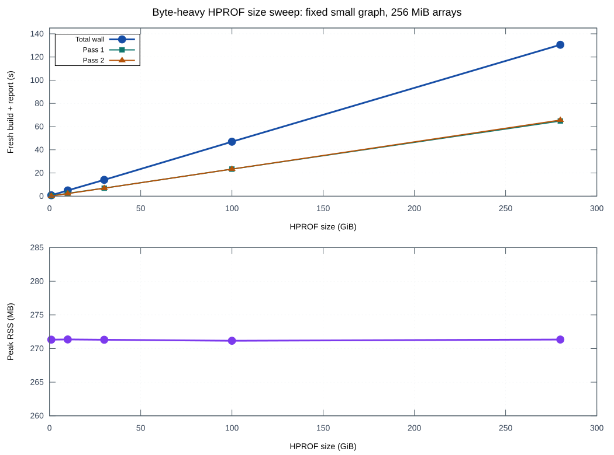
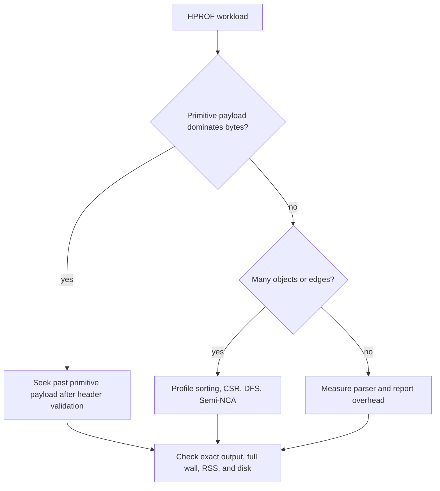

# Byte-heavy HPROF size sweep

The same synthetic workload was generated at five sizes on 2026-09-26/27:
1,000 instances, one class, 1,995 distinct edges, and rooted 256 MiB
primitive byte arrays. Array payloads are zero-filled. Each row is one fresh
build plus JSON report on the same macOS host (18 GiB RAM). The source dumps
are retained as verified `.hprof.zst` archives under `target/`; raw dumps
were removed after profiling to restore disk headroom.



| HPROF | Decimal size | Objects | Full wall | Pass 1 | Pass 2 | Peak RSS | Final index |
|---:|---:|---:|---:|---:|---:|---:|---:|
| 1 GiB | 1.07 GB | 1,005 | 0.79 s | 0.31 s | 0.17 s | 271.3 MB | 71 kB |
| 10 GiB | 10.74 GB | 1,041 | 4.97 s | 2.44 s | 2.21 s | 271.4 MB | 73 kB |
| 30 GiB | 32.21 GB | 1,121 | 14.08 s | 6.92 s | 6.91 s | 271.3 MB | 77 kB |
| 100 GiB | 107.37 GB | 1,401 | 46.96 s | 23.35 s | 23.37 s | 271.2 MB | 89 kB |
| 280 GiB | **300.65 GB** | 2,121 | **130.55 s** | 64.82 s | 65.62 s | **271.3 MB** | 121 kB |

For this fixture, elapsed time is almost linear in dump size. A descriptive
least-squares fit across these five single runs is `T ≈ 0.288 + 0.465 × GiB`
seconds (`R² ≈ 0.999996`); the fit is not a forecast for different graph
shapes or storage conditions. The measured RSS range is only 0.20 MB. The
280 GiB run reported 24.0 s user CPU, 107.9 s system CPU, no process swaps,
and unchanged system swap usage during the run. Its fresh and cached JSON
matched byte for byte.

Dump bytes are **not** the primary latency driver across all workloads. A
separate 1.07 GiB live-Java graph with about 20 million objects and 60 million
edges took 7.65 s and 1,599 MB peak RSS with the current build. The 1 GiB
byte-array fixture above took 0.79 s and 271 MB. At similar file size, graph
shape made the graph-heavy run about 9.7 times slower and 5.9 times larger in
RSS. That comparison is exploratory; the input data, not only its size, differs.

## What the result suggests



The rows above were measured before the production seek reader. Both scans
then read all primitive array bytes. The limited
An earlier header-only seek experiment visited the 1,120 array headers in the 280 GiB dump and sought
past their payloads in 0.162 s. It skipped other record bodies and did no
indexing, so this is only an optimistic bound. A production seek path must
handle segment lengths, reader read-ahead, EOF validation, and every HPROF
record while preserving exact outputs.

The subsequent [integrated seek result](primitive-seek.md) measures the full
build through 100 GiB on this fixture family and preserves exact output.

SIMD is a lower-priority candidate for this byte-heavy path: no primitive
payload values need decoding, and the 280 GiB build spent far more recorded
CPU time in the kernel than in user code. Compression of this fixture is also
misleading: its zero-filled 280 GiB source compresses to 9.75 MiB with zstd.
Real byte-array entropy and random-access needs require separate measurements.

To regenerate the CSV and SVG from the preserved profile directories:

```sh
python3 -B benches/plot_size_sweep.py
```

The [CSV](byte-heavy-size-sweep.csv) contains exact measured values; the
[plot source](../plot_size_sweep.gp) uses gnuplot.
