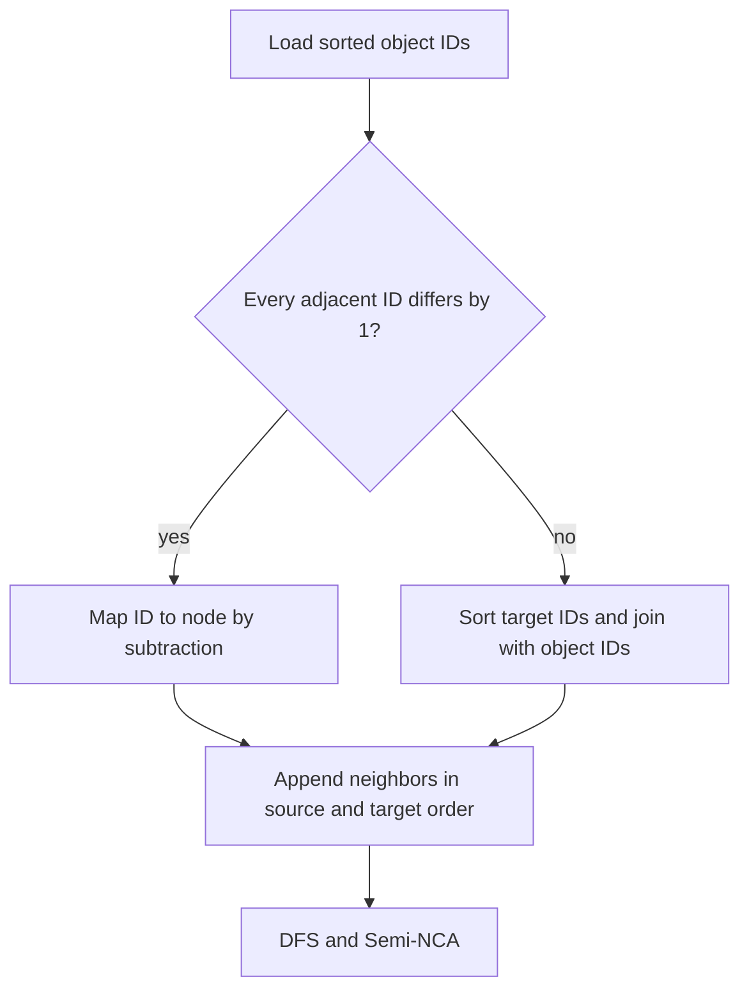

# Contiguous-ID adjacency path

Pass 3 now checks whether the sorted object IDs form one exact integer range.
When they do, `object_id - first_id` is the node index. The reader can build
forward CSR and reverse indexed edges directly from source-sorted `edges.bin`.
For indexes with gaps, pass 3 keeps the sort-and-join resolution path.

| Synthetic fixture | Resolution | Adjacency | Pass 3 | Full build and report | Peak RSS | Sampled peak index/scratch |
|---|---|---:|---:|---:|---:|---:|
| 100M objects, 200M edges | Sort/join | 15.22 s | 66.63 s | 82.54 s | 3.34 GB | 11.09 GB |
| Same HPROF | Direct range | 1.95 s | 53.70 s | 70.47 s | 3.34 GB | 8.96 GB |
| Same HPROF, automatic dispatch | Direct range | 1.55 s | 52.59 s | 68.38 s | 3.58 GB | 9.30 GB |
| Same HPROF, final code | Direct range | 1.86 s | 52.71 s | 68.98 s | 3.53 GB | 9.10 GB |
| 65M objects, 520M edges | Sort/join | 37.49 s | 152.71 s | 181.72 s | 5.38 GB | 24.31 GB |
| Same HPROF | Direct range | 4.16 s | 121.34 s | 154.57 s | 5.72 GB | 18.85 GB |
| Same HPROF, final code | Automatic direct range | 3.93 s | 118.03 s | 154.12 s | 5.93 GB | 18.98 GB |

Each row is one run, at different times on the same host. Relative to the
sort/join runs, the final-code 100M result saves 13.6 s (16.4%) end to end;
the final-code 65M result saves 27.6 s (15.2%).
`idom.bin`, `retained.bin`, and JSON matched byte for byte on each fixture.
In the final-code runs, sampled peak index/scratch space fell by 1.99 GB
and 5.33 GB respectively. Peak process RSS was higher by 0.20 GB and
0.55 GB respectively; these are single-run process peaks, so they should
not be interpreted as an isolated cost of the direct path.

Both fixtures use generator-assigned IDs `1..N`. This is a real HPROF index
property that the program verifies, but it is **not representative of typical
JVM address IDs**. Live Java graph dumps in this repository have gaps and
continue through sort and join. Earlier direct *binary search* experiments
were faster on those Java graphs and much slower on the random dense graph;
the binary-search variant has been removed pending a justified dispatch rule.
Do not extrapolate the direct-range speedup to ordinary noncontiguous IDs.

The remaining graph bottlenecks are unaffected by ID resolution. In the
100M fixture, DFS takes about 18 s and Semi-NCA about 25 s; in the final 65M dense
fixture, DFS takes 18.56 s and Semi-NCA 78.97 s. Instrumentation shows
almost all Semi-NCA time is in phase 1 semidominator computation. Two exact
EVAL shortcuts (DFS-parent and earlier-preorder predecessors) did not produce
a meaningful full-run improvement and were removed.
