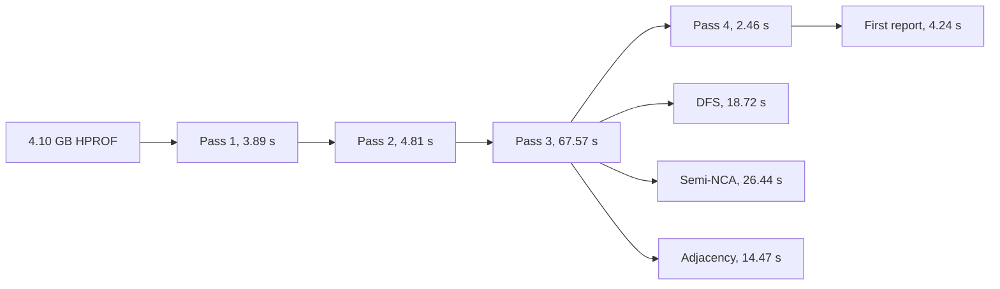

# 100 million-object synthetic graph

This fresh-build run uses `gen_hprof` with 100 million instances, 1,024
classes, two non-null random references per instance, and 10,000 GC roots.
It tests object and graph scale on the same host as the byte-array size sweep.
The result is one exploratory run, with normal file-cache and system-memory
variation.

This is the original sort-and-join baseline. The later
[contiguous-ID path](contiguous-ids.md) builds the same HPROF in 70.47 s with
byte-identical outputs.

```sh
target/release/gen_hprof --output target/object-heavy-100m.hprof \
  --objects 100000000 --classes 1024 --obj-fields 2 \
  --prim-fields 0 --null-pct 0 --roots 10000
python3 -B benches/profile_run.py target/object-heavy-100m.hprof \
  target/profile-object-heavy-100m
```

| Measurement | Result |
|---|---:|
| HPROF | 4.10 GB (3.82 GiB) |
| Objects / distinct edges | 100,001,024 / 199,999,999 |
| Reachable nodes, including virtual root | 79,681,768 |
| Fresh build and report | 82.99 s |
| Peak process RSS | 3.35 GB |
| Final index | 6.72 GB |
| Sampled peak index and scratch bytes | 10.95 GB |
| Process-reported swaps | 0 |
| System-wide swap-used change during run | +742 MB; attribution uncertain |
| Cached JSON comparison | Byte-identical to fresh JSON |



Pass 3 accounts for about 81% of whole-run wall time. DFS plus Semi-NCA
consume 45.2 s; adjacency construction adds 14.5 s. This graph has random
targets and 79.7 million reachable nodes, so its locality differs from a
live Java heap. SIMD in pass-2 reference extraction has a small ceiling here:
pass 2 is only 4.8 s of the 83.0 s run. Graph layout and traversal deserve
measurement first.

The 1–280 GiB [byte-heavy sweep](byte-heavy-size-sweep.md) has nearly fixed
`N` and `E`, while this run has a much smaller HPROF but an index larger than
its source. The two experiments should remain separate when estimating a new
dump's latency or memory requirements.
