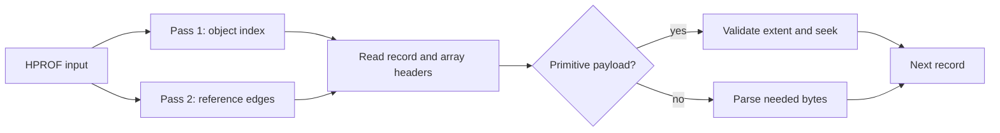

# Primitive-array seek result

The default HPROF reader now parses each primitive-array header and seeks over
the remaining payload. It reads at most one 1 MiB chunk past a header before
seeking. Passes 1 and 2 both use this path. The pipelined baseline in this
table is from the earlier version; that reader has been removed.

| Fixture | Reader | Full run | Pass 1 | Pass 2 | Peak process RSS |
|---|---|---:|---:|---:|---:|
| Rooted 10 GiB primitive bytes, 1,041 objects | Pipelined | 4.9695 s | 2.4417 s | 2.2106 s | 271.35 MB |
| Same HPROF | Seek | 0.5510 s | 0.0306 s | 0.0090 s | 5.36 MB |
| Rooted 100 GiB primitive bytes, 1,401 objects | Pipelined | 46.9561 s | 23.35 s | 23.37 s | 271.16 MB |
| Same HPROF | Seek | 0.7960 s | 0.1744 s | 0.0337 s | 5.42 MB |
| Live Java 20M objects, 60M edges | Pipelined, older run | 8.7878 s | 1.3429 s | 1.4322 s | 2.055 GB |
| Same HPROF | Seek | 8.3455 s | 0.9490 s | 1.5018 s | 1.385 GB |
| Synthetic 100M objects, 200M edges | Pipelined | 82.9862 s | 3.8918 s | 4.8148 s | 3.354 GB |
| Same HPROF | Seek | 82.5352 s | 3.6633 s | 5.3653 s | 3.336 GB |

These are one run per cell on the same host, at different times. The 20M
baseline predates other parser changes, so its RSS difference must not be
assigned to seeking. The seek reader skipped 10,695,542,309 payload bytes in
each pass of the 10 GiB run, 106,954,834,949 bytes per pass of the 100 GiB
run, and zero in the 100M-object run. The full run improved 9.0 times at
10 GiB and 59.0 times at 100 GiB. Peak RSS fell on the byte-heavy fixtures
because the seek reader does not reserve
three 64 MiB read-ahead buffers. The graph runs show no clear total-time
regression, but small differences are within run-to-run variation.

The JSON reports and `object_index.bin`, `edges.bin`, `roots.bin`,
`shallow_sizes.bin`, `idom.bin`, and `retained.bin` matched byte for byte on all
three fixtures. Both 32-bit and 64-bit golden integration fixtures pass under
the seek reader. A fixture truncated inside a primitive array fails with
`truncated HPROF array payload`.

The old 280 GiB byte-heavy sweep establishes the cost of reading unused bytes,
but the integrated seek path has been measured through 100 GiB so far. The
header-only 280 GiB seek probe is only an optimistic bound; it performs no indexing.
Compression of the zero-filled source is not a representative alternative:
real payload entropy varies, and a whole-file codec would need random access
to retain cheap array skipping.

With primitive payload I/O removed, the remaining big speed target is graph
construction and dominators. On 100M objects, pass 3 still takes about 67 s
of an 83 s run, led by Semi-NCA, DFS, and adjacency construction. SIMD changes
to the HPROF scanner cannot remove that graph work.
