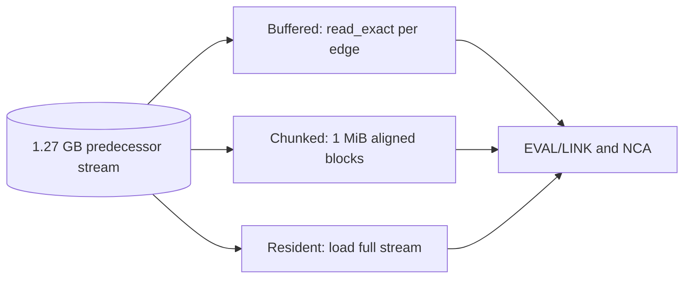

# Semi-NCA predecessor input probe

On the 100M-object graph, nearly all of the roughly 25 s Semi-NCA block is
phase 1 semidominator computation. The predecessor stream contains
159,373,533 fixed-size 8-byte records. A focused probe reused that stream
and the 79,681,768-entry DFS-parent array to compare input methods while
running the same EVAL/LINK and NCA logic.

| Probe mode | Phase 1 | Whole focused probe | Peak RSS | idom checksum |
|---|---:|---:|---:|---|
| 64 MiB `BufReader`, 8-byte `read_exact` calls | 26.88 s | 27.74 s | 1.66 GB | `c54d178ccba08d3f` |
| 1 MiB record-aligned blocks | 24.91 s | 25.72 s | 1.60 GB | Same |
| Load whole predecessor stream | 24.70 s | 25.43 s | 2.87 GB | Same |
| 1 MiB blocks, scan descending target preorder | 24.55 s | 25.34 s | 1.60 GB | Same |

Each mode ran once on the same preserved files, sequentially. Whole-probe
time includes file loading and phase 2; phase 1 timing starts after any
resident file load. The block scan achieved nearly the resident mode's
throughput without retaining the 1.27 GB input. Production now uses that
bounded block scan and validates complete 8-byte records.

In adjacent **full 100M-object builds**, the previous Semi-NCA stage took
25.16 s and the block-scan stage took 24.82 s. Whole-build times were
68.38 s and 68.98 s, respectively, showing that this small stage difference
is within run variation. JSON, `idom.bin`, and `retained.bin` matched byte
for byte. The sampled Semi-NCA RSS fell from 2.65 GB to 2.49 GB, although
sampled phase peaks are lower bounds and include allocator variation.

The focused result bounds the likely gain from faster predecessor decoding:
after removing the per-record read call, roughly 24.5 s remain in graph
state updates and EVAL/LINK on this random-reference graph. Two exact EVAL
shortcuts were tested separately and did not improve the full 100M run.
Further large speed gains likely need better graph-state locality or a
different dominator representation, measured on both random and live-Java
graphs.

The input files were ignored benchmark artifacts, retained as hard links to
`pred_sorted.bin` and `dfs_parent_pre.bin` while the 100M build was running.
The one-off probe program was removed after these measurements; full-build
comparisons use `benches/profile_run.py`.
