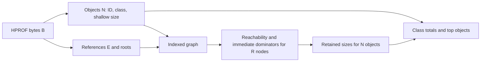
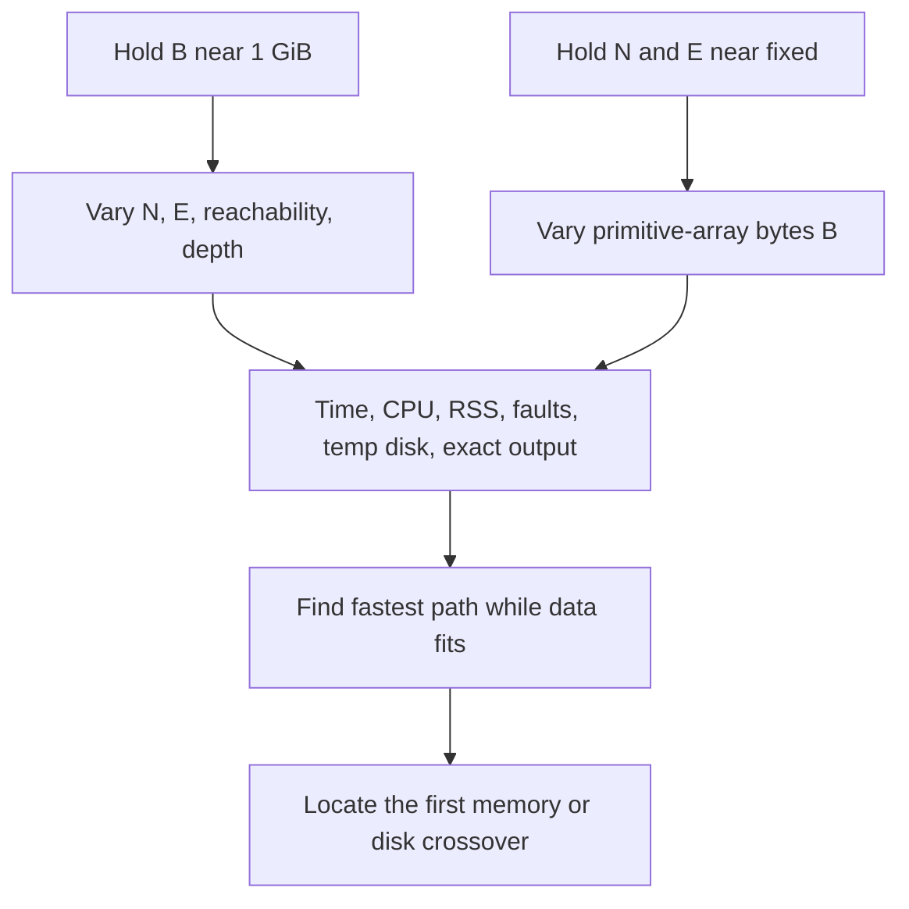

minprof workload and napkin model
=================================

What the program computes
-------------------------

An HPROF is a set of objects, references, roots, and payload bytes. `minprof`
first extracts a graph, then computes the immediate dominator of each object
reachable from a GC root. An object `v` dominates `u` if every root-to-`u`
path goes through `v`. Its retained size is the sum of shallow sizes of the
objects it dominates. The report aggregates these results by class and selects
top objects. Unreachable objects receive their shallow size in `retained.bin`.



Let `B` be HPROF bytes, `N` the number of objects, `M` the number of raw
non-null reference occurrences scanned by pass 2, `S` the number of edges
emitted after adjacent object-array repeats are removed, `E` the number of
distinct stored references after sorting and deduplication, `A` the largest
array subrecord payload, and
`R` the number of reachable nodes **including the virtual root**, and `P` the
primitive-array payload bytes that can be skipped. `B` can be
large because of a few primitive arrays, or because of many small,
interconnected objects. A single object array can make `M` much larger than
`E`, while `E ≤ S ≤ M`. Those are different workloads. A naive
root traversal for every object repeats work; the current graph algorithm
computes all dominators together and then accumulates retained sizes in one
reverse traversal.

Work by phase
-------------

| Phase | Current work | Main scale variable |
|---|---|---|
| Pass 1 | Parse HPROF headers, seek past primitive payloads, extract and sort 20-byte object records; write 4-byte shallow sizes | `B - P` read plus seek overhead; `N log N` sort if in memory |
| Pass 2 | Parse HPROF again, seek primitive payloads, scan raw references, elide adjacent object-array repeats, sort 16-byte emitted edges, then deduplicate | `B - P` read plus seek overhead, `M` scan, `S log S` sort if in memory; output `E` |
| Pass 3, endpoints | Resolve contiguous IDs by subtraction; otherwise sort 12-byte partial edges and join with object IDs | Dense: `N + E`; other: `N + E` plus sort of `E` records |
| Pass 3, graph | Count and fill forward CSR, DFS, sort 8-byte predecessor edges, run Semi-NCA | `N + E`, plus sort; graph shape affects DFS and Semi-NCA |
| Pass 4 | Sum shallow sizes up the dominator tree; write one 8-byte retained value per object | `N + R` |
| First report or summary-cache miss | Scan object and retained files together; aggregate by class and keep top objects | `N`, classes; independent of `E` |
| Summary-cache hit | Validate index generation and load derived report model | Serialized summary size; independent of `N` except through derived entries |

This describes *logical* work. Parsing and sorting overlap within a pass,
sequential I/O may hit the file cache, and an external sort adds chunk writes
and merges when records exceed its in-memory capacity. Therefore adding
isolated throughput estimates does not predict wall time exactly.

The earlier parser waited for an entire array subrecord and put its edges in
one output batch. The 64M-reference array has `M` near 64M but adds only one
distinct array edge to final `E`; its 492 MiB HPROF yielded 2.81 GB peak RSS
before this fix, versus 351 MB after incremental payload handling, bounded
batches, and adjacent-repeat elision. The final index is about 2.2 MiB in
both cases. The parser still scans `M` elements, but this fixture has `S`
near one for the large array. Nonadjacent repeats and unique references can
still make `S` approach `M`, and sort memory then depends on that volume.

The 16M-slot `shared` and `alternating` live-JVM dumps are nearly the same
size and have nearly the same final `N` and `E`. The shared array emits about
one sortable edge; the alternating array emits all 16M slots before global
deduplication leaves two array edges. Their measured peak RSS was 283 MB and
588 MB, respectively, while pass 2 took 0.032 s and 0.109 s. A 1M-slot
unique-target array instead grows `E` by roughly 1M and the final index to
52 MiB. These cases show why `M`, `S`, and `E` must be tracked separately.

Bytes that the current layout commits us to
--------------------------------------------

Ignoring small root, class, and metadata files, the final index is:

```text
object_index.bin   20 N bytes
edges.bin          16 E bytes
shallow_sizes.bin   4 N bytes
idom.bin            4 R bytes
retained.bin        8 N bytes
--------------------------------
final index        32 N + 16 E + 4 R bytes
summary miss       28 N bytes read (20 N + 8 N)
summary hit        read report_summary.json instead
HPROF parse        about 2 (B - P) bytes read, plus partial-buffer read-ahead
```

The seek-aware reader reduced a rooted 100 GiB primitive-array fixture from
46.96 s to 0.80 s full run, with exact index and JSON. It does not avoid scanning
object-array references or constructing the graph; the 100M-object fixture
remained near 83 s. These are single-run comparisons.

The first report or a summary miss still decodes `N` retained values. The
zstd stream experiment reduces retained *storage and source bytes* for that
scan, but it does not remove the `20N`-byte object scan or per-object work.
The normal repeat-report path now loads `report_summary.json` when it matches
the index manifest generation.

| Fixture | `B` | `N` | `E` | `R` | Predicted final index | Actual final index | Summary-miss scan |
|---|---:|---:|---:|---:|---:|---:|---:|
| Java graph | 1.07 GiB | 20.035 M | 60.061 M | 20.033 M | 1.567 GiB | ~1.6 GiB | 0.522 GiB |
| Existing synthetic index | 30.27 GiB | 500.024 M | 1,000.002 M | 398.426 M | 31.287 GiB | ~31 GiB | 13.039 GiB |

The formula and file sizes agree because this is a fixed-width layout. For
the synthetic index, the historical full-scan query's 20.56–21.05 s runs process about
23.8–24.3 million objects/s and about 0.62–0.64 GiB/s of *logical* index
bytes. These are whole-report rates, not measured storage bandwidth. The
20-million-object full-scan query took 0.54 s, about 37 million objects/s; the
difference can come from cache state, larger maps, CPU locality, and I/O.

There are two distinct latency targets. A **fresh build** computes retained
values and emits a report once, filling the summary cache. A **repeat report**
loads the derived model when its index generation matches. The original
break-even estimate for `K` repeat reports was:

```text
current:     T_build + K × T_full_scan
summarized:  T_build + T_summary_creation + K × T_summary_load
```

At 500 million objects, the raw scan was about 20.6 s. Retained-stream zstd
saved about 1.7–2.1 s in the earlier screening run; eliminating the repeated
scan has a much larger measured effect. The summary cache is now implemented
and generation-bound. The fresh-build path already performs this report scan
and serializes its computed summaries.
Object-level path queries still need the object and edge indexes.

The earlier opt-in prototype made this concrete: on the 500-million-object
index, a full raw report took 24.25 s, while loading and rendering a 1.92 MB
saved summary took 0.012 s with byte-identical JSON. Serializing that summary
took 0.004 s after the full scan had already computed it. These are historical
probe results; the production cache now uses manifest generation validation.

### What “1, 10, or 100 GiB heap” might mean

If a dump keeps the **same object and edge density** as the 20-million-object
Java graph, scaling its 1.07 GiB HPROF gives this conditional estimate. It is
not a prediction for arbitrary JVM heaps:

| HPROF target | Approx. objects / references | Final index | Cached scan | CSR fill payload | Endpoint temporary files |
|---|---:|---:|---:|---:|---:|
| 1 GiB | 18.8 M / 56 M | 1.5 GiB | 0.5 GiB | 0.3 GiB | 1.5 GiB |
| 10 GiB | 188 M / 563 M | 14.7 GiB | 4.9 GiB | 3.5 GiB | 14.7 GiB |
| 100 GiB | 1.88 B / 5.63 B | 147 GiB | 49 GiB | 35 GiB | 147 GiB |

The 100 GiB graph row exceeds the current `u32` CSR edge-count limit (~4.29
billion) before memory is considered. Its input, final index, and endpoint
temporary files alone total nearly 394 GiB, above this host's current free
disk. A 100 GiB heap dominated by a few primitive arrays could instead have
far fewer objects and edges and a much smaller index. This is why each run
must report `B`, `N`, `E`, `R`, graph shape, and payload mix rather than only
the nominal heap size.

The rooted 100 GiB synthetic byte-array run makes that alternative concrete:
`B = 100 GiB`, `N = 1,401`, `E = 1,995`, and `R = 1,204` including the virtual
root. Its final index is 88,917 bytes, and a fresh build plus report took
46.96 s at 271 MB peak RSS. Passes 1 and 2 each spent about 23.4 s on the
input; graph and retained work was milliseconds. This is a file-scale parser
measurement, with zero-filled arrays and a tiny graph, not a live 100 GiB JVM
or a representative object-dense dump.

The comparable 280 GiB (300.65 GB decimal) fixture took 130.55 s and peaked
at 271.3 MB RSS. Its object count grew only to 2,121 and distinct edges
remained 1,995. Across 1, 10, 30, 100, and 280 GiB, a descriptive fit is
`T ≈ 0.288 + 0.465 × B_GiB` seconds, with single-run `R² ≈ 0.999996`; peak
RSS varied by 0.20 MB. This slope is input-scanning cost for the fixed small
graph, not a universal HPROF cost model. See the
[size-sweep chart](benches/results/byte-heavy-size-sweep.md) and its CSV.

Memory and temporary disk at large graph scale
----------------------------------------------

The following are live array payloads implied by the code, **not predicted
RSS**. Arrays from different steps should not be summed across the whole run.

| Step | Approximate live payload | At 20 M objects / 60 M edges | At 500 M objects / 1 B edges |
|---|---:|---:|---:|
| Sorted ID table | `8N` | 0.149 GiB | 3.725 GiB |
| ID table while 12-byte partial edges are sorted | up to `8N + 12E` across overlapping sort buffers | 0.821 GiB | 14.90 GiB |
| Forward CSR while filling | `8N + 4E` (offsets, cursor, neighbors) | 0.373 GiB | 7.45 GiB |
| Semi-NCA EVAL nodes, DFS parents, and immediate dominators | `20R` during phase 2 | 0.373 GiB | 7.42 GiB |
| Retained write phase | `12R + 8N` (retained, RPO mapping, shallow, reverse mapping) | 0.373 GiB | 8.18 GiB |

The sorter targets 40% of total physical RAM: 7.2 GiB on this host. At one
billion edges, a full 7.2 GiB partial-edge buffer can coexist with a growing
second buffer and the 3.73 GiB ID table. The 14.90 GiB row is therefore a
plausible payload high-water mark before reader buffers, class data, allocator
retention, and the operating system. The observed 20-million-object run peaked
at 2.13 GB RSS despite smaller nominal arrays. Extrapolating that RSS by a
single factor would be misleading: the sort spills and cache behavior change
before 500 million objects. Swap may allow allocation while making wall time
much worse.

At the endpoint-resolution transition, `partial_sorted.bin` (~`12E`) remains
while forward and reverse indexed files (~`8E` each) are written. That is up
to `28E` temporary bytes, or about 28 GB for one billion edges, alongside the
object, shallow, and edge files (~28 GB). The workspace can therefore reach
roughly 56 GB **before** counting the input HPROF (~32.5 GB), sort chunks, and
filesystem overhead. This is an order-of-magnitude disk check, not a measured
peak; the next benchmark should record actual high-water disk use.

Reality checks and benchmark targets
------------------------------------

Two real Java HPROFs show why `B` alone is inadequate:

| Fixture | HPROF | Objects / edges | Fresh wall | Peak RSS | Dominator pass |
|---|---:|---:|---:|---:|---:|
| 1 GiB primitive arrays plus 100k graph nodes | 1.01 GiB | 0.135 M / 0.361 M | 0.65 s | 367 MB | <0.1 s at log resolution |
| 20 M graph nodes | 1.07 GiB | 20.035 M / 60.061 M | 7.89 s | 2.13 GB | 4.5 s |

The input sizes differ by only about 6%, but indexing time differs by 12×
and peak RSS by 5.8×. In the graph case, pass 3's 4.5 s includes 2.3 s for
adjacency construction, 0.9 s for predecessor sorting, and 0.8 s for the
logged Semi-NCA block. The remaining pass-3 time is DFS, mapping, and file
work. This points to graph construction and layout as near-term speed targets.

For the 500-million-object fixture we have a cached-query measurement, **not
a fresh-build measurement**. The formulas predict requirements; they do not
claim the current implementation can build that index within this host's
available RAM or at the 20-million-object throughput. The existing index was
generated earlier and should be treated separately from the live Java cases.

A fresh [100-million-object synthetic run](benches/results/object-heavy-100m.md)
now fills part of the gap: `B = 3.82 GiB`, `N = 100,001,024`,
`E = 199,999,999`, and `R = 79,681,768`. It took 82.99 s with a 3.35 GB
process peak, a 6.72 GB final index, and a 10.95 GB sampled peak disk
footprint. Pass 3 consumed 67.57 s. This random-reference graph is a
different shape from the live-Java graphs and does not justify projecting
linearly to 500M objects, but it confirms that graph work overtakes HPROF
scanning well before byte-heavy file sizes become large.

Those generator-assigned object IDs are contiguous, allowing a later
[direct-range adjacency path](benches/results/contiguous-ids.md). On the same
100M-object HPROF it reduced adjacency from 15.22 s to 1.95 s and the full
run from 82.54 s to 70.47 s with exact output. The 65M/520M dense fixture
fell from 181.72 s to 154.57 s. These gains apply only when the sorted IDs
pass the contiguous-range check; ordinary JVM address IDs usually do not.

The [Semi-NCA input probe](benches/results/semi-nca-input.md) shows that
record-aligned block reads remove nearly all of the extra memory used by
resident predecessor input. They save about 2 s in a focused 100M-object
probe, but only about 0.34 s in adjacent full-build Semi-NCA stages. Most
remaining phase-1 time is graph-state work, not sequential input decoding.

A new 65-million-object **synthetic** graph with 520 million random references
crosses the edge-sort spill threshold. Its measured fresh build plus report
takes 181.7 s; pass 3 takes 152.7 s, including 80.6 s for Semi-NCA and 18.6 s
for DFS. A direct-lookup variant takes 303.3 s on the same input, with exact
dominators, retained values, and JSON. The 50-million-object live-Java graph
instead takes 20.4 s, including only 2.2 s for Semi-NCA. These fixtures differ
in edge density and locality, so their times cannot be extrapolated from
`N` and `E` alone. See the [full comparison](design-review.md#full-build-direct-adjacency-comparison).



Benchmark the **build**, **summary miss**, and **summary hit** separately. For the build,
record the two HPROF scans, each sort and spill, endpoint resolution, CSR,
DFS, predecessor sort, Semi-NCA, retained pass, peak RSS, swap/page faults,
and peak scratch bytes. For the report, record cold and warm elapsed time,
CPU time, logical bytes, page faults, and output equality. Compare raw and
compressed representations on the same fixture, including encoding during
build. The first practical crossover question is whether a graph with enough
objects and edges to spill the current sorter remains faster than a smaller
buffer or a different endpoint representation on this host.
