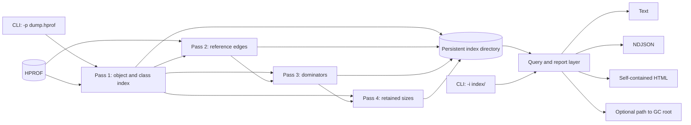
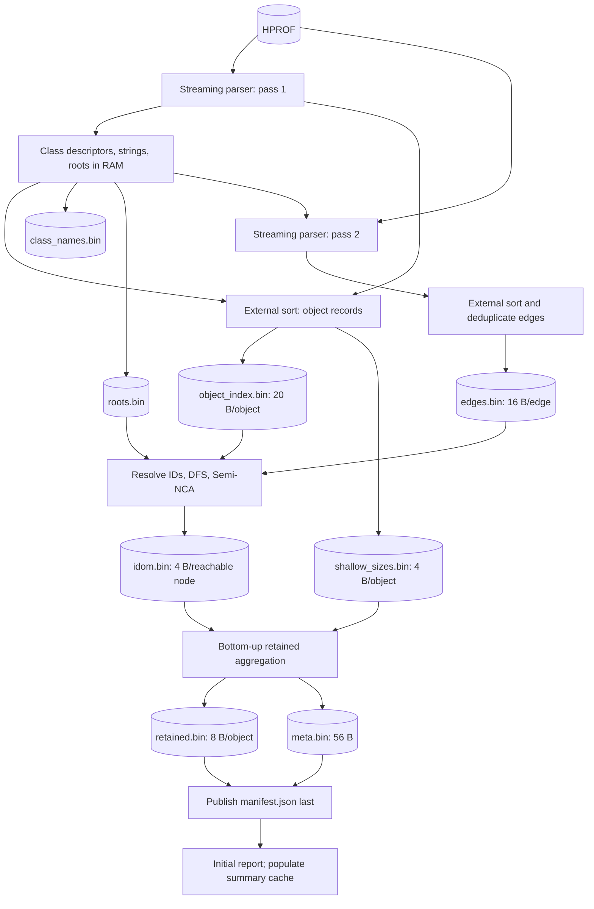
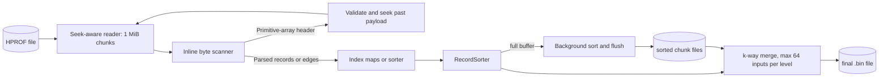
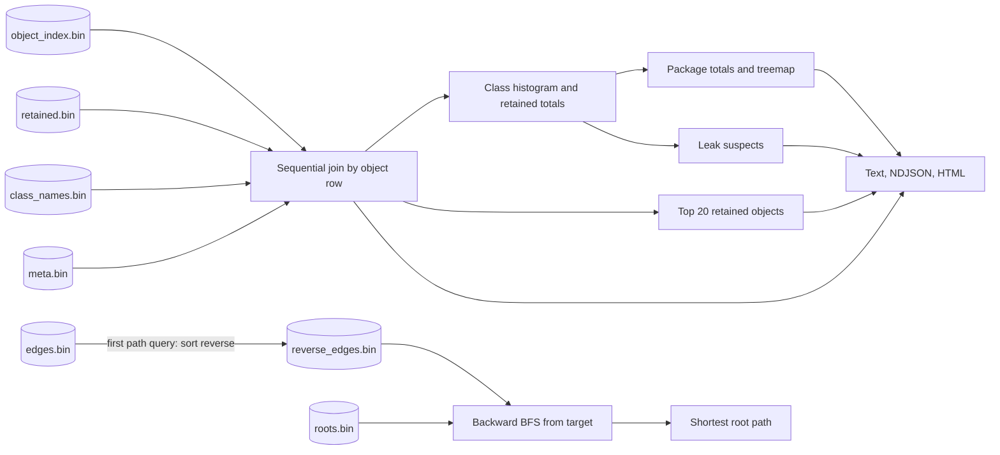
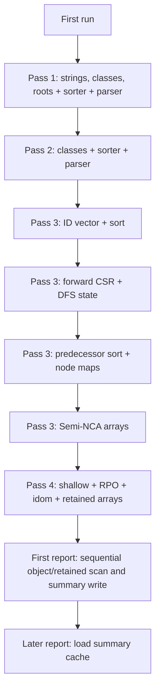
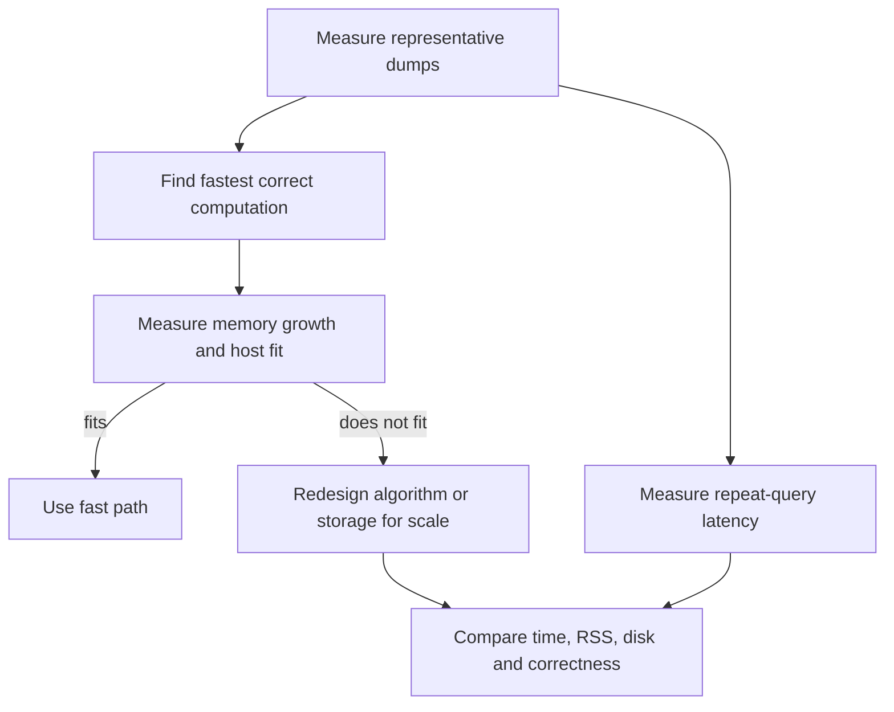

# minprof: current design and improvement sketch

Status: baseline design snapshot from commit `28974dc` (2026-09-26), updated with the measured parser, report-summary cache, and index manifest work. This is a working document for measuring and improving resident set size (RSS), throughput, disk use, and query latency. `N` means heap objects, `E` means distinct reference edges, and `R` means objects reachable from a GC root, including the virtual root where stated.

## 1. What the tool does

`minprof` turns a JVM HPROF heap dump into a reusable disk index, then produces a class histogram, retained heap views, leak suspects, package summaries, an HTML report, or a shortest path from an object to a GC root. A new dump takes four passes. A subsequent `-i` run reads the index and skips HPROF parsing. The CLI and index are implemented in Rust.

### Current contract

| Input or output | Current behavior |
|---|---|
| `-p <hprof>` | Builds the index and runs a report. Passes 1 and 2 each scan HPROF. |
| `-i <dir>` | Loads existing metadata and class names, then runs a report without HPROF. |
| `--report` | Selects histogram, retained, leaks, packages, or all. |
| `--format` | Text, NDJSON, or HTML. |
| `--path <object-id>` | Builds `reverse_edges.bin` on first use, then searches backward from the target. |
| `manifest.json` | Versioned completion marker with an index generation ID and required-file lengths. |
| `report_summary.json` | Cached full report model, reused when its generation matches the index manifest. |

## 2. First-run pipeline

**Pass 1.** The extractor emits UTF-8 strings, class loading and class dump metadata, roots, and object records. Object entries are sorted by object ID. During the final write, instance shallow sizes are fixed from class descriptors and also written to a compact sidecar. The pass holds the string table, class-name mapping, class descriptors, roots, and sort buffer in memory. The string table means its non-sort memory is not strictly limited to the number of classes.

**Pass 2.** The extractor uses precomputed reference-field offsets for each class, including inherited fields. It emits references from instances, object arrays, and static object fields. Object-array payloads are read incrementally in bounded batches, and adjacent repeated targets are removed before the sorter. The external sorter sorts `(from_id, to_id)` records and deduplicates them globally. The class descriptors remain resident through this pass.

**Pass 3.** Object IDs are loaded into a sorted `Vec<u64>`. If they form a
contiguous integer range, edge endpoints map directly to `u32` node indices;
otherwise an intermediate sort by target ID resolves them. A forward CSR
graph is built in RAM for DFS. Disk files hold DFS order and predecessor
edges between stages. Semi-NCA then computes dominators with resident
per-reachable-node arrays; `idom.bin` is written in reverse-postorder (RPO)
order. A virtual root connects to GC roots. This pass has the highest
graph-dependent memory use.

**Pass 4.** Shallow sizes, `idom`, and RPO mapping are loaded. Retained bytes are accumulated from descendants to dominators in reverse RPO, then written in object-index order. Unreachable objects receive their shallow size in `retained.bin`; the reachable total and unreachable shallow total are recorded separately.

## 3. Streaming parser and sorter

The reader and extractor share one thread so seeks cannot race with read-ahead.
Both passes handle array payloads incrementally; pass 2 limits edge output to
one million records per batch. Other whole-record paths can still grow the
work buffer. `RecordSorter` targets 40%
of detected **physical** RAM, clamped to 256 MiB–128 GiB. A flush overlaps
production, so a full background sort buffer can coexist with a growing new
buffer, plus parser buffers, class metadata, and I/O buffers. There is no
user-facing sort-memory setting in the current CLI. The budget does not
account for container or process limits.

## 4. Persistent index and query path

| File | Stored data | Approximate size | Use |
|---|---|---:|---|
| `object_index.bin` | Object ID, class ID, shallow bytes; sorted by ID | `20N` | ID lookup and report scan |
| `shallow_sizes.bin` | Shallow bytes in object order | `4N` | Pass 4 |
| `class_names.bin` | Class descriptors and names | varies | Report names and class metadata |
| `roots.bin` | Sorted, deduplicated root IDs | `8 × roots` | Dominators and path search |
| `edges.bin` | Distinct forward reference pairs | `16E` | Dominators and reverse-edge build |
| `idom.bin` | Immediate dominator in RPO order | `4R` | Pass 4 |
| `retained.bin` | Retained bytes in object order | `8N` | Reports |
| `meta.bin` | Version and six summary counters | 56 bytes | Reconstruct query metadata |
| `manifest.json` | Index generation and required-file byte lengths | small JSON | Completion and cache invalidation |
| `report_summary.json` | Full derived report model | workload-dependent | Cached reports and HTML |
| `reverse_edges.bin` | Reverse reference pairs | `16E` | Built on first `--path` use |

`idom.bin` and `shallow_sizes.bin` remain on disk after indexing, even though ordinary `-i` report runs do not read them. The core index without reverse edges is approximately `32N + 16E` bytes plus roots and class names. The optional reverse file adds approximately `16E`. Pass 3 also creates transient edge and DFS files, so peak **disk** use is higher than the final index.

On a summary-cache miss, the report collector scans every object and retained value once and keeps class aggregates and a bounded top-20 heap. It writes the derived report model atomically to `report_summary.json`; subsequent reports load that summary when its generation matches the manifest. Cache population remains `O(N)` and reads about `28N` bytes, while cached report collection is proportional to summary size. Legacy indexes are structurally checked and receive a manifest on first load. A `build_in_progress` marker prevents an interrupted overwrite from being treated as a legacy index. A path query performs binary searches and local scans in the reverse edge file; its BFS queue and predecessor map can grow with the explored graph.

## 5. Where memory and time go today

The large resident allocations visible in code include an `8N` object-ID vector during edge resolution; a `4E` neighbor array plus `4(N+1)` offsets and, during CSR construction, another `4(N+1)` cursor; a `12R` EVAL/LINK array plus `4R` parent and later `4R` idom arrays; and pass 4's `4N` shallow array, `4N` node-to-RPO map, `4R` idom, `4R` RPO map, and `8R` retained array. These are component sizes, **not an additive peak estimate**: lifetimes differ. The sort buffer can dominate other phases, especially on a machine with a large physical-memory report or a smaller container limit.

The code uses `u32` node indices, preorder/RPO indices, and CSR offsets. That imposes a practical scale limit near the `u32` range for nodes or distinct edges; the precise safe limit is lower where a sentinel or virtual root is reserved. Pass 3 now rejects counts above its representable range before loading the ID table. Broader format and malformed-file checks remain future work for claims about larger dumps.

The README and architecture introduction now state the graph-dependent memory requirement and on-demand reverse-edge behavior. The measured array fixtures show another independent dimension: maximum record size and raw reference occurrences can set parser RSS even when the final index is small.

## 6. Improvement strategy

### A. Establish a reproducible baseline

Record total and per-phase wall time, peak RSS, bytes read and written, temporary disk high-water mark, object count, edge count, reachable count, and generated index size. Cover at least: a byte-heavy dump, a class-heavy dump, an edge-heavy dump, a dump with substantial unreachable data, and one near the host's memory capacity. Compare output bytes or semantic results with the current golden fixtures and a larger generated fixture. Repeat trials under controlled cache conditions. Treat the README's existing synthetic throughput number as a historical observation until reproduced on the target machine.

### B. Find the fastest correct path

Compare algorithms, data layouts, and pass boundaries while the working set fits in RAM. At 20 million graph nodes and about 60 million edges, pass 3 takes about 4.5 seconds of a 7.0-second index build; adjacency construction accounts for about 2.3 seconds. This makes adjacency construction a speed candidate before replacing its in-memory CSR. Use total build time and identical dominator/retained output to judge variants; a local stage speedup that slows the full pipeline is not a win.

### C. Adapt the fast path when memory runs out

Estimate each stage's working set from `N`, `E`, and `R` and compare it with host or container limits and currently available **physical** memory, leaving room for the OS, parser, and merge buffers. Keep the fast path where it fits. Where it does not, compare a lower-memory algorithm or storage layout under a host-dependent budget. Treat swap capacity and page-ins as separate feasibility/performance signals rather than adding swap directly to the RSS budget. Log peak RSS, swap activity, and elapsed time per pass. Add checked conversions for node counts and edge counts and a clear error before any `u32` overflow.

Pass 1 retains every UTF-8 string until class names are resolved. Measure this table before trying a smaller name lookup, while preserving HPROF record-order independence.

For pass 3, compare mapped or paged access to the `8N` ID table and disk-backed or partitioned adjacency only when the measured in-memory version stops fitting. DFS can revisit far-apart adjacency ranges, so simply swapping `Vec` for `mmap` may lower allocator use while causing page-cache pressure and I/O stalls. Budget Semi-NCA's node arrays as well; moving graph edges out of RAM alone does not make the phase independent of `N`.

Pass 4 can be revisited after pass 3: its simultaneous arrays also scale with `N`/`R`. Evaluate whether the RPO mapping and retained output conversion can be staged with on-disk arrays or blocked updates without excessive random I/O.

### D. Cut repeat-query work where it matters

The default summary cache now removes the full report scan after the first report. Measure cold and warm cache behavior on varied class counts, report selections, and HTML output to confirm the serialized model stays small and useful. For repeated `--path`, measure reverse-edge build time, reverse-file footprint, BFS memory, and the frequency of multiple queries on one index before choosing a persistent reverse index or a different graph search layout.

### E. Reduce disk and I/O after profiling

Account for temporary files as well as the final index. Test larger merge fan-in, smaller I/O buffers, or compressed sequential files only against measured disk and elapsed-time gains. Compression should be per file and access pattern: the ID index and reverse edges need efficient random lookup, while some temporary streams are sequential. Define a versioned index manifest and completion marker before changing on-disk layouts, so partial runs and incompatible indexes fail clearly.

Initial whole-file probes on three 64 MiB regions of the older 30 GiB synthetic index show zstd level 1 ratios of about 3.25× for edges, 8.75× for object records, 21.46× for retained sizes, and 3.77× for dominators; LZ4 fast produces smaller gains but faster standalone decoding. These are screening results, not integrated minprof timings. Test independently decodable blocks and any needed block index before changing random-lookup files, and compare total build/query wall time on real JVM dumps.

## 7. Decisions to answer with experiments

| Question | Measurement or acceptance gate |
|---|---|
| Which phase sets peak RSS on target dumps? | Per-phase peak RSS and allocation breakdown, including parser and sort overlap. |
| Can pass 3 avoid resident `4E` CSR neighbors? | Same dominators and retained results; target RSS reduction with acceptable wall time and disk traffic. |
| Does mapped ID lookup help? | RSS, major faults, edge-resolution time, and cold-cache behavior. |
| How large can a supported dump be? | Checked node/edge limits and a graceful error at the boundary. |
| Are repeat reports actually fast enough? | Cold and warm `-i` latency versus index size, including HTML generation. |
| Which data should be precomputed? | Query frequency and size of class/package summaries versus index-build cost. |

## 8. Code map and verification

| Area | Main files |
|---|---|
| CLI and index loading | `src/main.rs` |
| Shared streaming parser | `src/parser/record_stream_parser.rs` |
| Pass 1 and class records | `src/passes/index/mod.rs` |
| Pass 2 and reverse edges | `src/passes/edges/mod.rs` |
| External sorting and budget | `src/passes/sort.rs`, `src/passes/mod.rs` |
| Dominators and CSR | `src/passes/dominators/mod.rs` |
| Retained aggregation | `src/passes/retained/mod.rs` |
| Reports and root paths | `src/query/mod.rs`, `src/query/html.rs` |
| Existing checks | `tests/integration.rs`, `benches/passes.rs` |

The integration tests compare persistent outputs byte for byte for 32-bit and 64-bit fixtures and check that index reuse reproduces report output. The Criterion bench can generate larger synthetic dumps. For architecture changes, add targeted correctness cases for disconnected objects, multiple roots, duplicate references, and graph shapes that stress DFS and dominators; benchmark before and after under identical memory and storage conditions.
